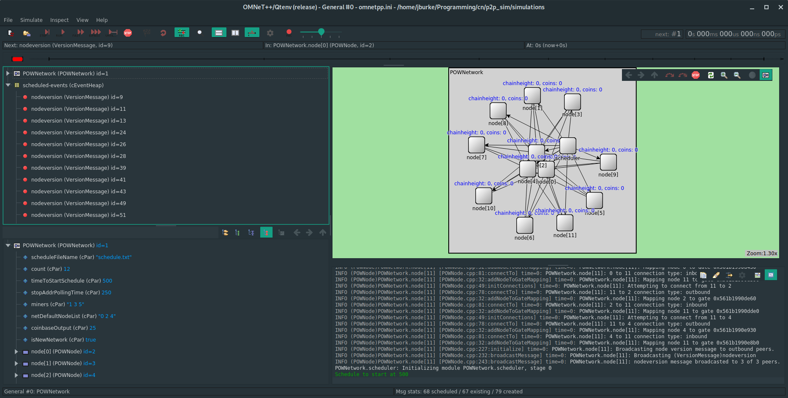
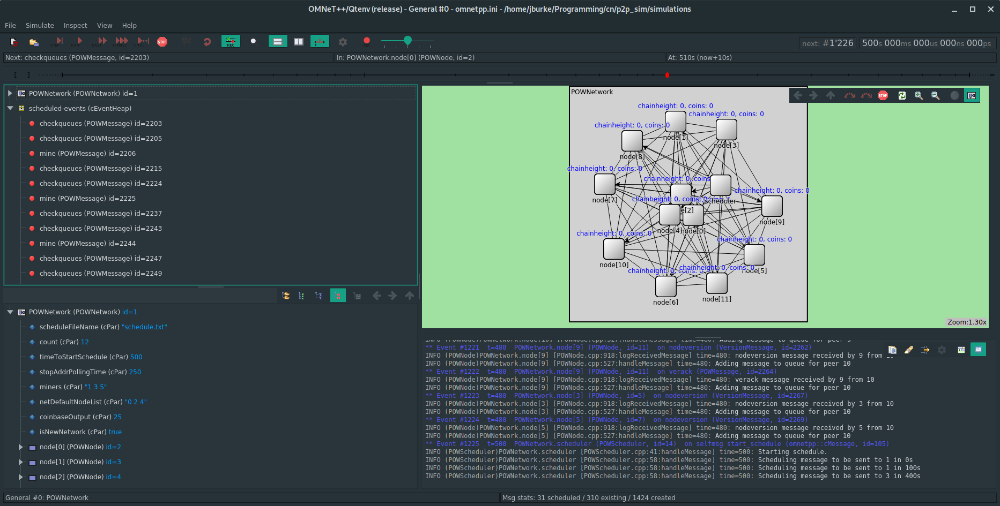
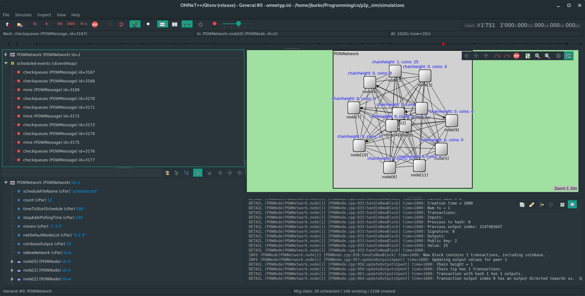
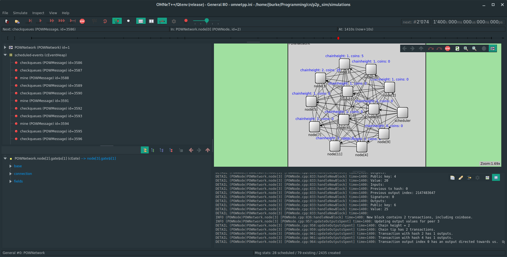
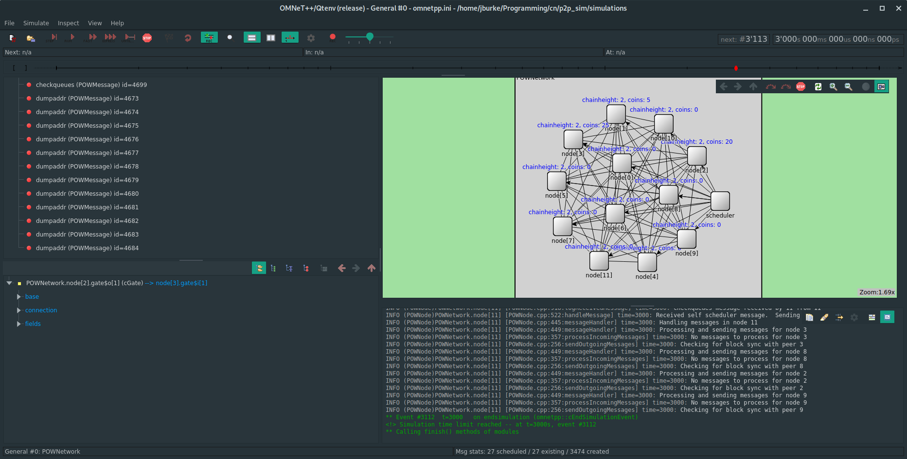
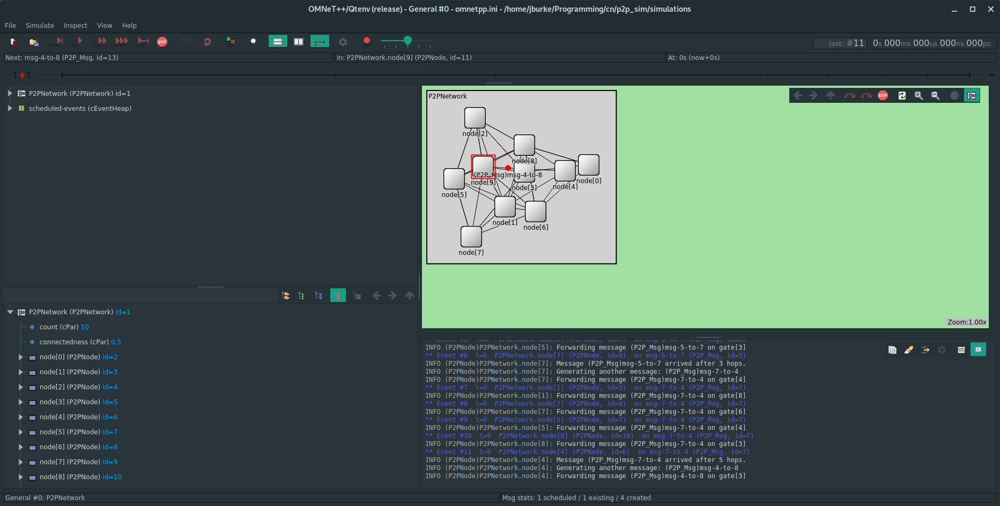

# CN-Simulation
Implementation of a peer to peer network simulation using Omnet++.  Will be used to demonstrate various security issues of blockchain based networks.

In our example simulation, we schedule a block to be created by node 1, then a transaction with destination node 2, and finally a block containing that transaction to be created by node 3.
## Network setup
This is what the network looks like upon setup:

Note that each node is only connecting to the default set of nodes (here, nodes 0, 2, and 4).

## Schedule startup
After a user-specified amount of time, the scheduler sends messages based on the user's schedule file.  The simulation state for this is shown here:

Note that the network has become more interconnected following peer advertisement.

## Creation of first block
This is what the simulation looks like after the first block has been created:

Note the change in the blue label above node 1, indicating it now has a chain height of 1 and 25 coins.  These coins are the reward for having mined a block.  The other nodes do not know about this block yet, because the block announcement has not had the chance to propagate yet.

## First transaction
The next event is the first transaction, where node 1 sends 20 coins to node 2.  This is what the network looks like:

Notice the decrease in coins for node 1.

## Creation of second block
After some time, node 2 validates the aforementioned transaction and creates a new block containing it.  This is what the network looks like:

Notice the first block has propagated through most of the network (chain height = 1 for most of the nodes), and node 3 has 25 coins from the reward for creating a block.

## Final state
The final state of the network involves the full propagation of both blocks, and node 2 receiving the 20 coins in the transaction from node 1.

Currently simulation creates a mesh of randomly interconnected nodes.  A message is created with a random destination and forwarded until the destination is reached.  The destination node then creates a new message, and the process repeats.  An example with 10 nodes is shown here:

